# Отель "Toxin". Бронирование номеров в отеле.

SPA приложение с клиент-серверной архитектурой.
# Админ Login/Password: admin@mail.ru, Test1234
# deploy: secret-mesa-68506.herokuapp.com/

# Стек технологий
- React, Typescript
- React-Redux, Redux Toolkit
- SASS, MUI
- NodeJS, Express, MongoDB

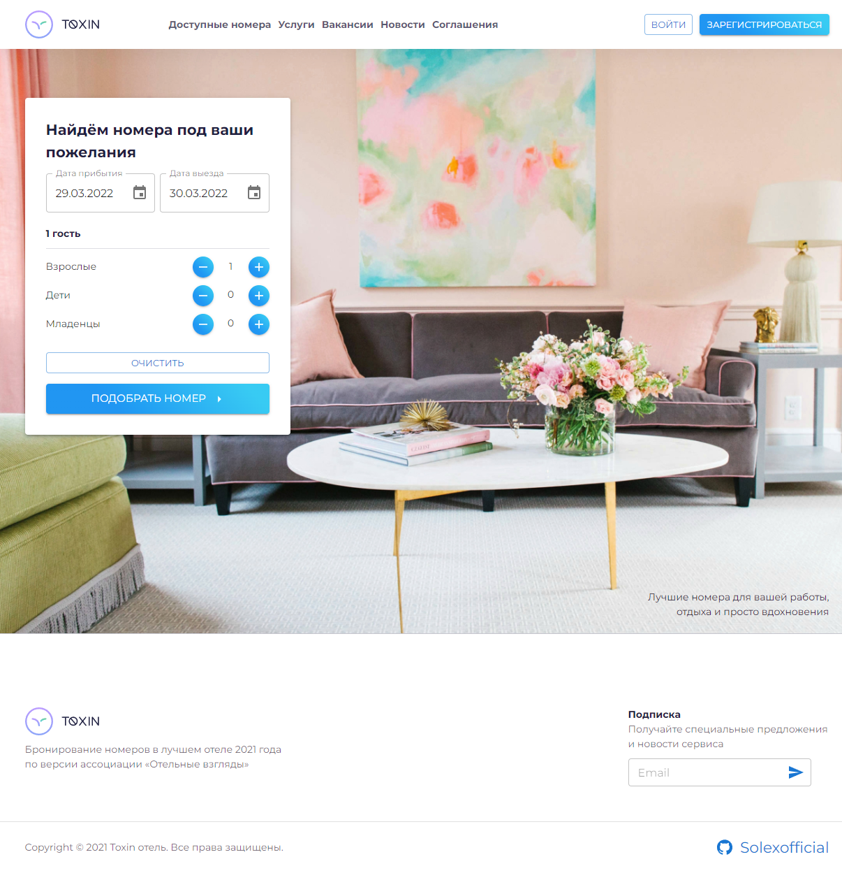

# Реализовано

- Авторизация и регистрация

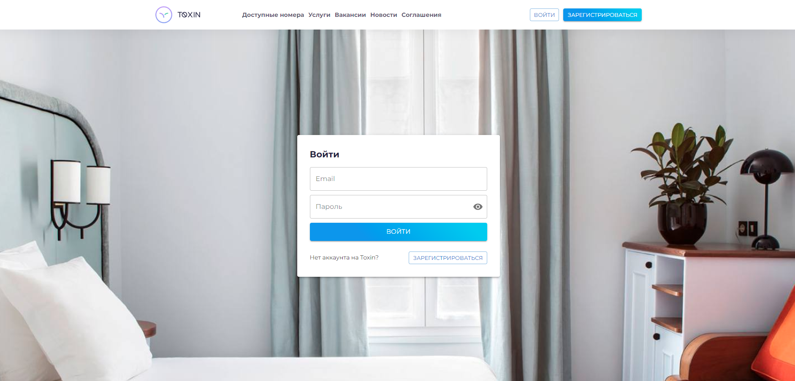
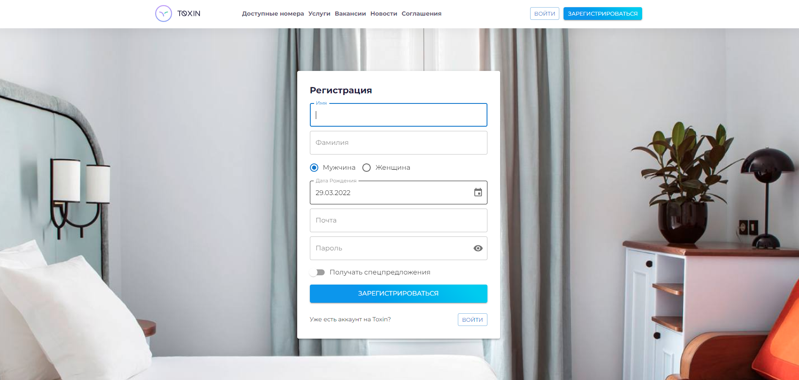

- Страница с доступными номера ( Поиск, Сортировка, Фильтрация, Пагинация)

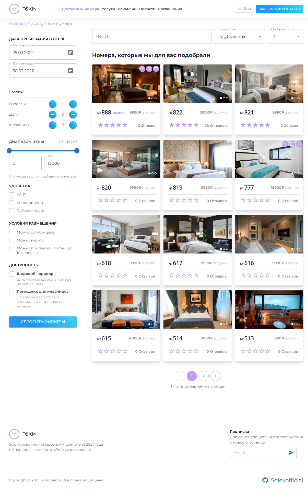
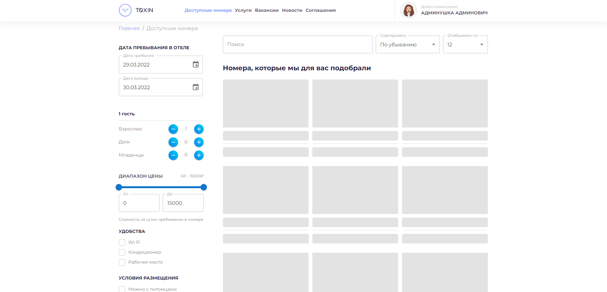

- Страница номера (Забронировать, лайк комментария, оставить отзыв могут только авторизованные пользователи)

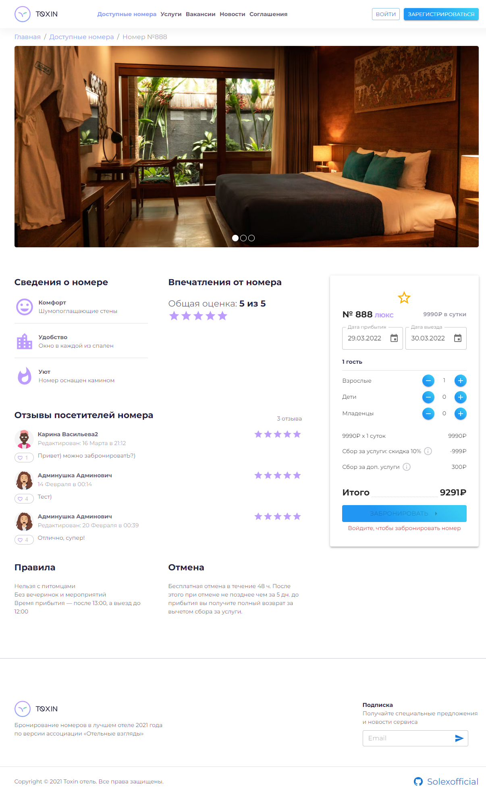

- Меню и страница пользователя

- Панель администратора, меню, страница администратора

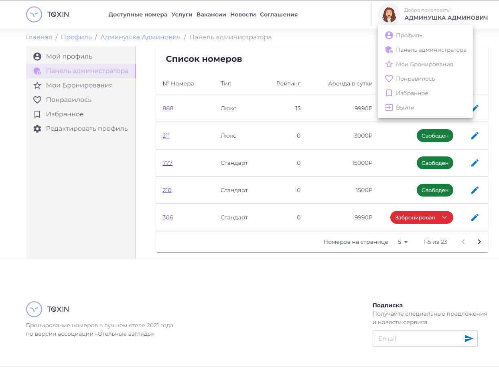

- Панель администратора(Список бронирований для каждого номера, отмена бронирования, страница пользователя, кто забронировал номер).

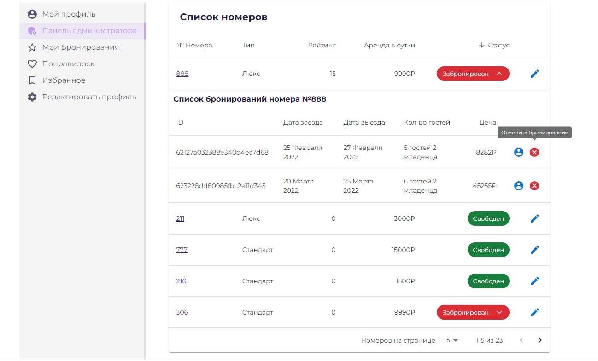

- Страница редактирования пользователя

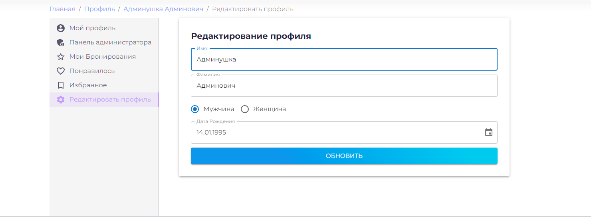

- Возможность оставить отзыв для номера, система лайков, рейтинг.  

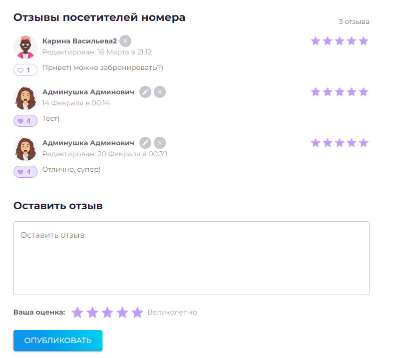

- Страница редактирования номера( only user role is Admin )  

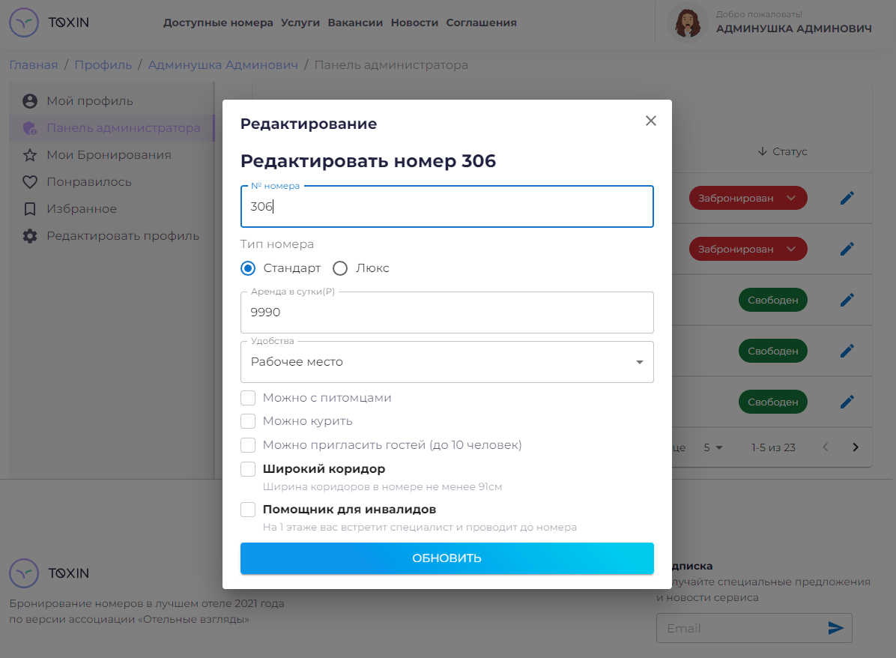

- Страницы: Мои Бронирования, Понравилось, Избранное.  

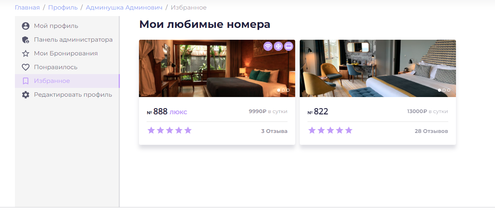
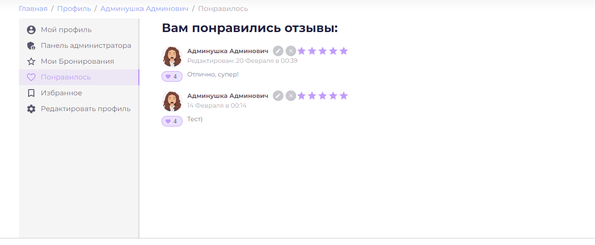
